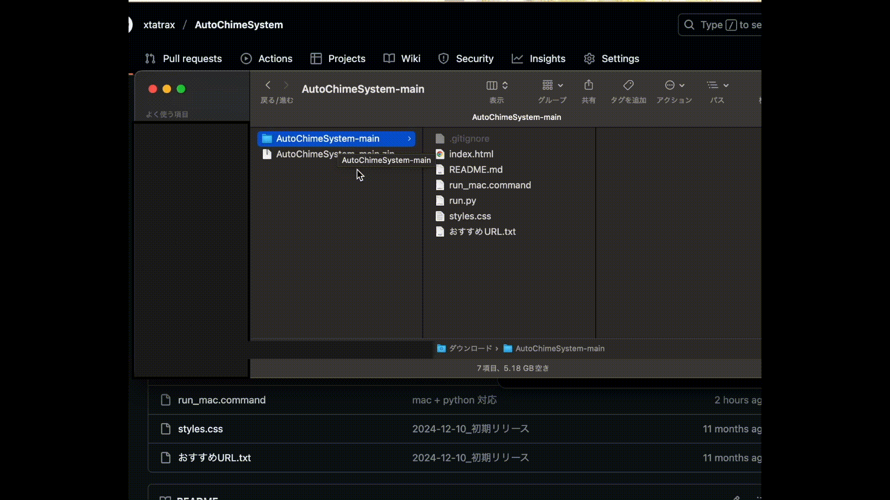

# AutoChimeSystem

kH25Nk77n01/AutoChimeSystem からのフォーク

# 前提

python3 の http.server モジュール

-> [python.org](https://www.python.org/downloads/)

# 使い方

run.py を実行

実行時にブラウザが開かない場合 -> http://localhost:8000

ターミナル(黒い画面)で ctrl + c で終了

## mac

## win
run_win.cmd 未実装